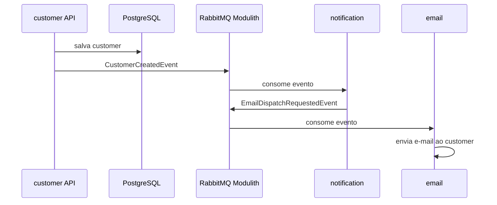
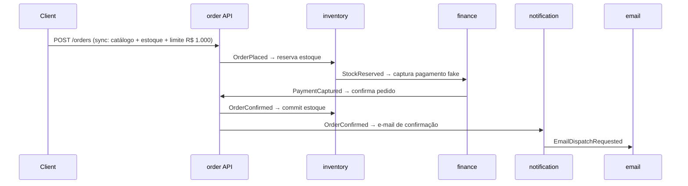
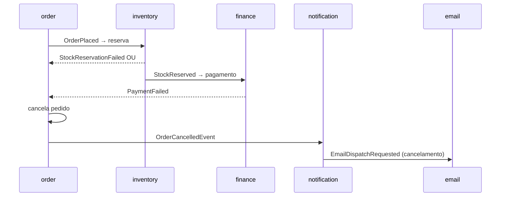

# Spring Service Monolith

Monólito modular em **Java 21** e **Spring Boot 3.5.x** com **Spring Modulith**, arquitetura **Diplomat** por módulo, observabilidade, **PostgreSQL**, **Redis**, **RabbitMQ**, e-mail (**MailHog** em dev) e API **OpenAPI**.

## Módulos

| Módulo | Responsabilidade |
|--------|------------------|
| **customer** | Cadastro de clientes (REST + JPA) |
| **catalog** | Produtos/SKUs e preços de lista |
| **inventory** | Estoque, reservas e movimentações |
| **order** | Pedidos (sync + coreografia async) |
| **finance** | Captura de pagamento fake pós-reserva |
| **identity** | Contas, autenticação multi-provider, autorização |
| **notification** | Orquestra notificações (ex.: boas-vindas) |
| **email** | Envio de e-mails (SMTP / in-memory em testes) |
| **shared** | Wire de integração (`wire/in/events`), models auth (`models/auth`), contratos (`contracts`) |

## Autenticação multi-provider

Estratégias configuráveis em `app.security.strategies` (podem ser combinadas):

| Estratégia | Ativação | Fluxo |
|------------|----------|-------|
| **jwt-external** | `JWT_EXTERNAL_ENABLED=true` | `/api/v1/auth/login` e `/api/v1/auth/token` fazem **proxy** para o Keycloak; API valida Bearer JWT |
| **local** | `LOCAL_AUTH_ENABLED=true` | `/api/v1/auth/register`, `/api/v1/auth/login` e `/api/v1/auth/token` respondem direto no monólito |
| **social** | `SOCIAL_AUTH_ENABLED=true` + credenciais Google | OAuth2 Login em `/oauth2/authorization/google`; produção: preferir brokering via Keycloak |

Entrypoint unificado (qualquer estratégia ativa):

| Endpoint | Descrição |
|----------|-----------|
| `GET /api/v1/auth/config` | Estratégias habilitadas e paths estáveis |
| `POST /api/v1/auth/register` | Registro local (`501` se só auth externa) |
| `POST /api/v1/auth/login` | JSON `{email,password,provider?}` — local ou proxy Keycloak |
| `POST /api/v1/auth/token` | OAuth2 form (`grant_type=password`, …) — proxy ou token local |

Keycloak local (Docker): http://localhost:8091 — realm `monolith`, usuário demo `demo-user` / `demo-password`.

```bash
docker compose up --build

# 1. Ver capacidades de auth (inclui bloco `external` com provider Keycloak)
curl -s http://localhost:8080/api/v1/auth/config | jq .

# 2. Registrar conta local (disponível com LOCAL_AUTH_ENABLED=true no compose)
curl -s -X POST http://localhost:8080/api/v1/auth/register \
  -H 'Content-Type: application/json' \
  -d '{"email":"user@example.com","password":"password123"}'

# 3a. Login local (conta criada acima)
TOKEN=$(curl -s -X POST http://localhost:8080/api/v1/auth/login \
  -H 'Content-Type: application/json' \
  -d '{"email":"user@example.com","password":"password123"}' \
  | jq -r '.accessToken')

# 3b. Ou login Keycloak demo (proxy externo)
TOKEN=$(curl -s -X POST http://localhost:8080/api/v1/auth/login \
  -H 'Content-Type: application/json' \
  -d '{"email":"demo-user@example.com","password":"demo-password","provider":"external"}' \
  | jq -r '.accessToken')
```

Auth local no host:

```bash
export LOCAL_AUTH_ENABLED=true
mvn spring-boot:run -Dspring-boot.run.profiles=local
curl -X POST http://localhost:8080/api/v1/auth/register \
  -H 'Content-Type: application/json' \
  -d '{"email":"user@example.com","password":"password123"}'
```

Endpoints de customer exigem `ROLE_USER` quando alguma estratégia de auth está ativa. Detalhes: [docs/modules/identity.md](docs/modules/identity.md).

## Fluxo: cadastro → e-mail de boas-vindas



1. `POST /api/v1/customers` persiste o cliente.
2. Publica `CustomerCreatedEvent` (evento compartilhado).
3. **notification** reage e publica `EmailDispatchRequestedEvent`.
4. **email** envia o e-mail para o próprio cliente.

## Fluxo commerce: pedido → confirmação → e-mail



Regras principais:

- Validação **síncrona** na API: SKU ativo, estoque disponível, soma de pedidos `CONFIRMED` + novo total ≤ R$ 1.000.
- Cobrança **somente após** `StockReserved` (finance não escuta `OrderPlaced`).
- Módulos se comunicam via **`shared.contracts`** (sync) e **`shared.wire.in.events`** (async); sem HTTP interno.

Exemplo (perfil `test` ou auth desligado):

```bash
# 1. Cliente (header X-Idempotency-Key obrigatório em POST mutáveis)
curl -s -X POST http://localhost:8080/api/v1/customers \
  -H 'Content-Type: application/json' \
  -H 'X-Idempotency-Key: 550e8400-e29b-41d4-a716-446655440000' \
  -d '{"email":"buyer@example.com","fullName":"Buyer"}'

# 2. SKU (substitua {skuId})
curl -s -X POST http://localhost:8080/api/v1/catalog/skus \
  -H 'Content-Type: application/json' \
  -H 'X-Idempotency-Key: 6ba7b810-9dad-11d1-80b4-00c04fd430c8' \
  -d '{"productName":"Widget","code":"W-1","listPrice":150.00}'

# 3. Estoque
curl -s -X POST http://localhost:8080/api/v1/inventory/adjustments \
  -H 'Content-Type: application/json' \
  -H 'X-Idempotency-Key: 7c9e6679-7425-40de-944b-e07fc1f90ae7' \
  -d '{"skuId":"{skuId}","quantityDelta":10}'

# 4. Pedido (substitua {customerId})
curl -s -X POST http://localhost:8080/api/v1/orders \
  -H 'Content-Type: application/json' \
  -H 'X-Idempotency-Key: 8f14e45f-ceea-467a-9aa5-686cf38c8940' \
  -d '{"customerId":"{customerId}","lines":[{"skuId":"{skuId}","quantity":1}]}'
```

Replay da mesma operação (mesma chave + mesmo body) retorna **200** com o recurso já persistido.

Endpoints: `POST/GET /api/v1/catalog/skus`, `POST /api/v1/inventory/adjustments`, `GET /api/v1/inventory/skus/{id}/availability`, `POST/GET /api/v1/orders`.

## Fluxo commerce: falha da saga → cancelamento → e-mail

Quando reserva de estoque ou captura de pagamento falha **após** o pedido ser aceito (`201`), a saga compensa e publica um único `OrderCancelledEvent`. O módulo **notification** consome esse evento (fila `monolith.order-cancelled.notification.queue`) e envia e-mail ao cliente — sem consumir `StockReservationFailed` ou `PaymentFailed` separadamente (evita duplicata).



Rejeições **síncronas** na API (`409` estoque, `422` limite de gasto) não passam pela saga — o cliente recebe só a resposta HTTP.

Para simular falha de pagamento em testes/E2E: `app.finance.payment-gateway.always-fail=true`.

**RabbitMQ:** eventos com múltiplos assinantes usam filas dedicadas por módulo (ex.: `monolith.stock-reserved.order.queue` e `.finance.queue`). Após mudanças de topologia, recrie volumes: `docker compose down -v`.

## Stack

| Camada | Tecnologia |
|--------|------------|
| Runtime | Java 21 |
| Framework | Spring Boot 3.5.14, Spring Modulith 1.4.10 |
| API | Spring Web, springdoc-openapi |
| Persistência | JPA, PostgreSQL, Liquibase |
| Mensageria | Spring AMQP, Modulith Events AMQP |
| E-mail | Spring Mail, MailHog (local) |
| Cache | Redis (infra compartilhada) |
| Resiliência | Resilience4j (circuit breaker + retry no envio de e-mail e integração OAuth2) |
| Erros | Sentry (opcional via `SENTRY_DSN`) |
| Segurança | Spring Security, OAuth2 Resource Server / Client / Authorization Server, Keycloak |
| Eventos | Spring Modulith Events API (`@Externalized` + externalização AMQP) |
| Produtividade | Lombok, MapStruct |

Convenções: [docs/CONVENTIONS.md](docs/CONVENTIONS.md) · Guidelines: [docs/GUIDELINES.md](docs/GUIDELINES.md)

## API

```bash
curl -X POST http://localhost:8080/api/v1/customers \
  -H 'Content-Type: application/json' \
  -H 'X-Idempotency-Key: 550e8400-e29b-41d4-a716-446655440000' \
  -d '{"email":"ana@example.com","fullName":"Ana Baptista"}'
```

- Swagger: http://localhost:8080/swagger-ui.html
- MailHog UI (e-mails locais): http://localhost:8025

## Infraestrutura local

```bash
docker compose up -d postgres redis rabbitmq mailhog
mvn spring-boot:run -Dspring-boot.run.profiles=local
```

Ou tudo no Docker (o `Dockerfile` compila o JAR com Maven):

```bash
docker compose up -d --build
```

## Observabilidade

- **Métricas**: `/actuator/prometheus`
- **Tracing OTLP**: desligado por padrão (`OTEL_EXPORT_ENABLED=false`) — evita erro ao subir sem coletor em `localhost:4318`
- **Jaeger** (opcional no Docker): http://localhost:16686 — UI com alternância claro/escuro (`docker/jaeger/ui-config.json`, ver [Frontend/UI](https://www.jaegertracing.io/docs/2.dev/deployment/frontend-ui/))

Tracing no host, com Jaeger:

```bash
docker compose up -d jaeger
export OTEL_EXPORT_ENABLED=true
export OTEL_EXPORTER_OTLP_ENDPOINT=http://localhost:4317
export OTEL_EXPORTER_OTLP_TRANSPORT=grpc
mvn spring-boot:run -Dspring-boot.run.profiles=local,observability
```

No Jaeger UI, o serviço aparece como `spring-service-monolith` (e spans por módulo Modulith). Use o botão de tema (claro/escuro) na barra superior.

Com o perfil `observability`, queries JDBC aparecem como spans filhos (ex.: `SELECT`, `INSERT`) via [Datasource Micrometer](https://jdbc-observations.github.io/datasource-micrometer/docs/current/docs/html/), com SQL em `db.query.text` / tags OpenTelemetry. Logs de SQL vão para o logger `jdbc.query` (nível DEBUG). Parâmetros de bind **não** são exportados por padrão (`jdbc.datasource-proxy.include-parameter-values=false`).

Para subir com tracing habilitado: `mvn spring-boot:run -Pobservability-run`.

**Banco de dados:** após a consolidação das migrations Liquibase, ambientes locais existentes podem precisar de reset (`docker compose down -v`) antes de subir novamente.

Outras camadas (perfil `observability`):

| Camada | Spans / logs | Como |
|--------|----------------|------|
| **Redis** | `spring.data.redis` (comandos Lettuce) | `InfrastructureObservabilityConfiguration` + cache em `GET /api/v1/customers/{id}` |
| **RabbitMQ** | publicação/consumo AMQP + `traceId`/`spanId` em logs | `spring.rabbitmq.*.observation-enabled=true` (baseline) + header W3C `traceparent` |
| **SMTP** | `email.send` | `@Observed` em `SmtpEmailSender` |
| **Liquibase** | `liquibase.change` (startup) | listener no `SpringLiquibase` |

## Integrações do demo

| Biblioteca | Uso no projeto |
|------------|----------------|
| **spring-modulith-events-api** | `@Externalized` em `shared.wire.in.events` + `ModulithEventConfiguration` |
| **resilience4j** | `@CircuitBreaker` / `@Retry` em `SendEmailController` e `OAuth2NotificationPlatform` |
| **Sentry** | `Sentry.captureException` em `GlobalExceptionHandler` e fallbacks |
| **oauth2-client** | `OAuth2NotificationPlatform` (client credentials) quando `NOTIFICATION_PLATFORM_ENABLED=true` |

## Testes

```bash
mvn test      # unitários
mvn verify    # integração + e2e (Docker)
```

## Novo módulo

```bash
./scripts/create-module.sh billing
```

Depois inclua changelog Liquibase e siga [docs/GUIDELINES.md](docs/GUIDELINES.md) (checklist completo) e [docs/CONVENTIONS.md](docs/CONVENTIONS.md) (referência rápida).
