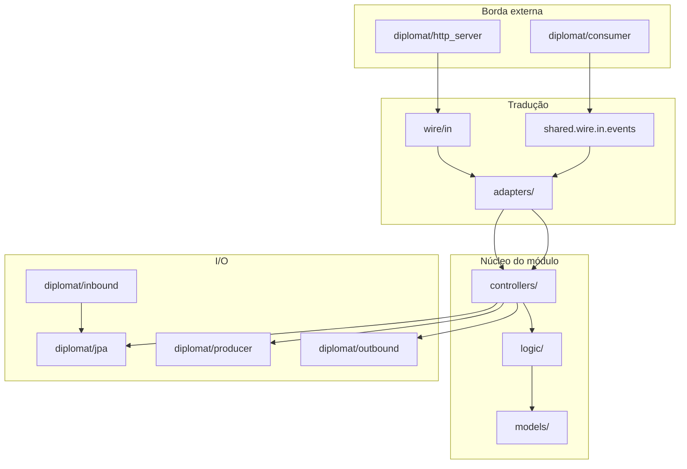

# Guidelines de implementação

Guia prático para **qualquer nova funcionalidade** nesta POC respeitar os padrões já estabelecidos. Complementa o resumo em [CONVENTIONS.md](CONVENTIONS.md) e a documentação por módulo em [modules/](modules/).

**Referência arquitetural:** [Diplomat Architecture](https://github.com/nubank/clojure-guidelines/blob/main/clojure-guidelines.mdc) (origem dos pacotes `models`, `logic`, `controllers`, `adapters`, `wire`, `diplomat`).

---

## 1. Princípios

| Princípio | O que significa na prática |
|-----------|----------------------------|
| **Modulith first** | Cada bounded context vive em `modules/<nome>` com `@ApplicationModule(allowedDependencies = {"shared"})`. Módulos **não** importam `diplomat` de outros módulos. |
| **Logic sandwich** | Controllers orquestram: gather (I/O) → logic (puro) → effects (persistir, publicar). Regras de negócio ficam em `logic/`, nunca em consumers ou HttpServer. |
| **Wire na borda** | HTTP e mensageria usam DTOs (`wire/` ou `shared.wire.in.events`). Domínio usa `models/`. Tradução só em `adapters/`. |
| **Sync via contratos, async via eventos** | Leitura/validação imediata → `shared.contracts.*` + `diplomat/inbound`. Coreografia → `@Externalized` + filas dedicadas. |
| **Producers burros, consumers idempotentes** | Publicação sempre que o controller invoca o producer. Duplicata de mensagem é segura porque cada **step** persiste com `idempotency_key` UNIQUE. |
| **Enforcement automatizado** | `ArchitectureTest` (ArchUnit) valida fronteiras de pacote. Quebrar uma regra deve falhar o build. |

---

## 2. Mapa mental da arquitetura



**Fluxo HTTP mutável (com idempotência):**

```text
Request (wire/in)
  → adapter.wireInTo*Input
  → controller (findByIdempotencyKey → replay | rules → save → producer)
  → adapter.modelToWireOut
  → Response (wire/out) + 201 ou 200 (replay)
```

**Fluxo consumer:**

```text
WireEvent (shared.wire.in.events)
  → *EventAdapter.wireToModel
  → controller.handle(model)
  → persistence / producer (sem regra de negócio no consumer)
```

---

## 3. Estrutura de pacotes

```text
dev.ebaptistella.monolith/
├── MonolithApplication.java
├── config/                         # cross-cutting (security, rabbit, openapi, idempotency, observability)
├── shared/                         # módulo Modulith OPEN
│   ├── wire/in/events/             # payloads @Externalized
│   ├── models/auth/                # AuthenticatedUser (pós-auth, não é wire)
│   ├── contracts/                  # SPI sync entre módulos e config
│   ├── idempotency/                # IdempotencyKeys, Context, fingerprint
│   ├── EventRoutes.java            # exchanges, filas, DLQ, EXTERNALIZED keys
│   └── web/GlobalExceptionHandler  # ProblemDetail + Sentry
└── modules/<modulo>/
    ├── package-info.java           # @ApplicationModule(allowedDependencies = {"shared"})
    ├── models/                     # records de domínio
    ├── logic/                      # regras puras + *Result records
    ├── controllers/                # @Service — casos de uso
    ├── adapters/                   # wire ↔ model (classes finais, métodos estáticos)
    ├── wire/in, wire/out           # DTOs HTTP do módulo
    └── diplomat/
        ├── http_server/            # *HttpServer @RestController
        ├── jpa/                    # *Entity, *Persistence, *JpaRepository
        ├── producer/               # publica eventos via ApplicationEventPublisher
        ├── consumer/               # @RabbitListener → adapter → controller
        ├── inbound/                # implements shared.contracts.*
        ├── outbound/               # *Gateway → contratos de outros módulos
        ├── cache/                  # (opcional) leitura cacheada
        └── smtp/ | inmemory/       # (opcional) integrações específicas
```

### O que **não** fazer

- Colocar `@RestController` em `controllers/` — HTTP fica em `diplomat/http_server/*HttpServer`.
- Importar classes de `modules.outro.diplomat` — use `shared.contracts` ou eventos.
- Usar `@Data` em `@Entity` — use `@Getter` / `@Setter` / `@NoArgsConstructor(PROTECTED)`.
- Prefixar classes com `Diplomat` — o pacote já indica a camada.
- Compartilhar fila Rabbit entre módulos — uma fila por `@RabbitListener`.

---

## 4. Camadas em detalhe

### 4.1 `models/`

- **Tipo:** `record` imutável.
- **Conteúdo:** identidade, atributos de negócio, timestamps, campos de idempotência quando aplicável (`idempotencyKey`, `rootIdempotencyKey`, `requestFingerprint`).
- **Sem:** anotações Spring, JPA, Jackson de wire.

Exemplo: `modules/customer/models/Customer.java`.

### 4.2 `logic/`

- **Tipo:** classe `final` com construtor privado e métodos `static`, ou records `*Result`.
- **Entrada/saída:** apenas `models/` e outros tipos de `logic/`.
- **Sem:** Spring, I/O, wire, UUID de persistência gerado pelo banco (exceto `UUID.randomUUID()` para novas entidades em rules).

Padrão de result:

```java
public record CustomerRegistrationResult(
        Optional<Customer> customer,
        Optional<String> error,
        boolean replay) {

    public boolean rejected() { return error.isPresent(); }

    public static CustomerRegistrationResult success(Customer c) { ... }
    public static CustomerRegistrationResult replay(Customer c) { ... }
}
```

Regras de transição de estado (saga/event handlers): métodos `can*` e `shouldSkip*` em classes `*Rules` — ver `OrderRules`.

### 4.3 `controllers/`

- **Anotação:** `@Service` (não `@RestController`).
- **Dependências:** `diplomat.jpa`, `diplomat.producer`, `diplomat.outbound`, `logic`, `shared.idempotency`.
- **Proibido:** importar `wire.*` (validado por ArchUnit).
- **Transação:** `@Transactional` no método do caso de uso quando há persistência + evento na mesma unidade lógica.

**Logic sandwich em três passos:**

1. **Gather** — `persistence.find*`, gateways sync, `IdempotencyContext.requireRootKey()`.
2. **Logic** — `*Rules.validate*` / `*Rules.register*`.
3. **Effects** — `persistence.save`, `producer.publish*`.

**Idempotência em entidades raiz (POST HTTP):**

```java
UUID rootKey = IdempotencyContext.requireRootKey();
UUID entityKey = IdempotencyKeys.derive(rootKey, "customer.register");
String fingerprint = IdempotencyPayloadFingerprint.sha256(input, objectMapper);

var existing = jpa.findByIdempotencyKey(entityKey);
if (existing.isPresent()) {
    IdempotencyAssertions.assertMatchingFingerprint(existing.get().requestFingerprint(), fingerprint);
    return *Result.replay(existing.get());
}
// ... rules → save com entityKey, rootKey, fingerprint → producer
```

**Idempotência em steps saga (consumer):**

```java
UUID stepKey = IdempotencyKeys.derive(rootKeyFromEvent, "inventory", "reserve", orderId, skuId);
if (persistence.findReservationByIdempotencyKey(stepKey).isPresent()) {
    return StockReservationResult.idempotent(...);
}
```

Referências: `RegisterCustomerController`, `PlaceOrderController`, `ReserveStockController`.

### 4.4 `adapters/`

- **Tipo:** classe `public final` com construtor privado.
- **Métodos:** `wireInTo*`, `modelToWireOut`, `wireToModel`, `modelToWire` (eventos).
- **Sem:** dependência de `logic/` ou `controllers/` (ArchUnit).

Convenção de nomes:

| Direção | Método típico |
|---------|---------------|
| HTTP request → model input | `wireInToRegistrationInput` |
| Model → HTTP response | `modelToWireOut` |
| Event wire → model notification | `wireToModel` |
| Model → event wire | `modelToWire` |

### 4.5 `wire/in` e `wire/out`

- **Tipo:** `record` com Bean Validation (`@NotBlank`, `@Email`, etc.).
- **wire/in:** `@JsonIgnoreProperties(ignoreUnknown = true)` para tolerância a campos extras.
- **wire/out:** factory estática `from(model)` quando útil — ver `CustomerResponse`.

OpenAPI: documentar header `X-Idempotency-Key` nos POST/PUT/PATCH mutáveis (parâmetro ou descrição da operação).

### 4.6 `diplomat/jpa`

| Artefato | Responsabilidade |
|----------|------------------|
| `*Entity` | Mapeamento JPA; `fromModel` / `toModel`; package-private quando possível |
| `*JpaRepository` | Spring Data |
| `*Persistence` | API usada pelos controllers; `@CachePut` / cache reader aqui, não no controller |

**Entity:**

```java
@Entity
@Table(name = "customers")
@Getter @Setter
@NoArgsConstructor(access = AccessLevel.PROTECTED)
class CustomerEntity {
    // colunas snake_case; idempotency_key UNIQUE quando aplicável
}
```

**Liquibase:** um arquivo por módulo/contexto em `db/changelog/changes/NNN-<modulo>-*.sql`, incluído em `db.changelog-master.yaml`. Formato `--liquibase formatted sql` com `--changeset monolith:...`.

### 4.7 `diplomat/http_server`

- Classe `*HttpServer` com `@RestController` e `@RequestMapping("/api/v1/...")`.
- **Delega** a controllers; traduz wire via adapters.
- **Erros de domínio rejeitados:** `ResponseStatusException` com status HTTP adequado.
- **Replay idempotente:** `IdempotentHttpOutcome` → `200` vs `201`.
- **Sem** acesso direto a JPA (ArchUnit).

Exemplo: `CustomerHttpServer.createCustomer`.

### 4.8 `diplomat/producer`

- Injeta `ApplicationEventPublisher`.
- Converte model → wire com `*EventAdapter.modelToWire`.
- Publica record anotado com `@Externalized(EventRoutes.*_EXTERNALIZED)`.
- **Sem** lógica condicional de dedup — o controller decide se chama ou não (replay HTTP não chama).

### 4.9 `diplomat/consumer`

```java
@Component
@RequiredArgsConstructor
public class CustomerCreatedConsumer {

    private final WelcomeNotificationController controller;

    @Observed(name = "rabbit.receive", contextualName = "customer-created consume")
    @RabbitListener(queues = EventRoutes.CUSTOMER_CREATED_QUEUE)
    public void onCustomerCreated(CustomerCreatedEvent event) {
        controller.notify(CustomerCreatedEventAdapter.wireToModel(event));
    }
}
```

Regras:

- Payload do listener = `shared.wire.in.events.*` (wire).
- **Sem** `@Slf4j` (ArchUnit).
- **Sem** regra de negócio nem log de rejeição de domínio.
- **Com** `@Observed` para tracing.

### 4.10 `diplomat/inbound` e `diplomat/outbound`

**Inbound** — implementa contrato em `shared.contracts`:

```java
@Component
@RequiredArgsConstructor
public class LocalCustomerQuery implements CustomerQuery {
    private final CustomerPersistence persistence;  // MUST: JPA, não controller
}
```

**Outbound** — gateway do módulo consumidor:

```java
@Component
@RequiredArgsConstructor
public class LocalCustomerGateway implements CustomerGateway {
    private final CustomerQuery customerQuery;  // contrato, não persistence alheia
}
```

Interface do gateway fica no módulo consumidor (`order/diplomat/outbound/CustomerGateway`); implementação delega ao SPI publicado pelo módulo dono dos dados.

---

## 5. Integração entre módulos

### 5.1 Tabela de decisão

| Cenário | Mecanismo | Onde definir |
|---------|-----------|--------------|
| Validar SKU/preço/estoque na API síncrona | `CatalogQuery`, `StockAvailabilityQuery` | `shared/contracts` + `diplomat/inbound/Local*Query` |
| Orquestrador precisa de dado de outro módulo | Gateway + contrato | `diplomat/outbound/*Gateway` |
| Notificar outro contexto após commit | Evento | `shared.wire.in.events` + producer/consumer |
| Auth em toda API | `IdentityResolver`, `CurrentUserProvider` | `modules/identity` + `config/security` |

### 5.2 Eventos (`shared.wire.in.events`)

Todo record de evento cross-module:

1. Primeiro campo: `UUID idempotencyKey` (root `R` ou derivada conforme o step).
2. Anotação `@Externalized(EventRoutes.*_EXTERNALIZED)`.
3. Constantes em `EventRoutes`: `EXCHANGE`, `QUEUE`(s), `ROUTING_KEY`, `EXTERNALIZED`, `DLX`, `DLQ`, `DLQ_ROUTING_KEY`.

**Fan-out (vários consumidores):** mesmo exchange e routing key, **filas diferentes**:

```text
STOCK_RESERVED_ORDER_QUEUE    → order
STOCK_RESERVED_FINANCE_QUEUE  → finance
```

Registrar cada fila em `RabbitTopologyConfiguration` com DLX/DLQ próprios.

### 5.3 Notification / email

- **notification:** reage a eventos de domínio; monta conteúdo em `logic/*Rules`; publica `EmailDispatchRequestedEvent`.
- **email:** consome dispatch; `SendEmailController` deduplica por `dispatchId` determinístico (`IdempotencyKeys.derive` no adapter).
- Falhas de saga → **um** `OrderCancelledEvent` para notification (não consumir `StockReservationFailed` + `PaymentFailed` separadamente).

---

## 6. Idempotência (`X-Idempotency-Key`)

| Aspecto | Regra |
|---------|-------|
| Header | Obrigatório em `POST`/`PUT`/`PATCH` sob `/api/**` (exceto `/auth/login`, `/auth/token`) |
| Valor | UUID em `X-Idempotency-Key`; filter popula `IdempotencyContext` |
| Entidade raiz | Colunas `idempotency_key` UNIQUE, `root_idempotency_key`, `request_fingerprint` |
| Replay HTTP | Mesma chave + mesmo body → **200** + recurso existente |
| Conflito | Mesma chave + body diferente → **409** (`IdempotencyConflictException`) |
| Steps saga | `IdempotencyKeys.derive(R, scope, ...)` por linha/agregado |
| Producers | Sempre publicam quando invocados; dedup só no controller/persistence |

Utilitários: `shared/idempotency/*`, filter `config/idempotency/IdempotencyWebFilter`.

Testes E2E: `IdempotencyTestSupport.withIdempotencyKey(spec)` ou `.header(X_IDEMPOTENCY_KEY, newKey())`.

---

## 7. Segurança e auth

- Wire externo: JWT claims, OAuth2 tokens — parse em `config/security`.
- Modelo interno: `shared.models.auth.AuthenticatedUser`.
- Endpoints protegidos: `@PreAuthorize("hasRole('USER')")` no HttpServer.
- Registro/login/token: isentos do header de idempotência onde aplicável.

Detalhes por estratégia: [modules/identity.md](modules/identity.md).

---

## 8. Erros e resiliência

| Camada | Padrão |
|--------|--------|
| Validação HTTP | Bean Validation → `GlobalExceptionHandler` → `ProblemDetail` 400 |
| Rejeição de negócio na borda | `ResponseStatusException` no HttpServer |
| Idempotência | `IdempotencyConflictException` → 409 |
| Não encontrado | `NoSuchElementException` → 404 |
| E-mail / OAuth2 externo | Resilience4j `@CircuitBreaker` / `@Retry` + `EmailDispatchException` → 503 |
| Não tratado | Sentry via `GlobalExceptionHandler.capture` |

---

## 9. Observabilidade

- Rabbit: `spring.rabbitmq.*.observation-enabled=true` (traceparent W3C).
- Consumers e SMTP: `@Observed`.
- Logs: `traceId`/`spanId` via MDC; `idempotencyKey` no MDC durante request HTTP.
- DLQ: `DeadLetterConsumer` → `SentryDeadLetterReporter`.
- Perfil opcional `observability` para export OTLP/Jaeger.

---

## 10. Testes

| Tipo | Convenção | Maven |
|------|-----------|-------|
| Unitário | `@Tag("unit")`, Mockito para persistence/producers | `mvn test` (Surefire) |
| Integração | `@Tag("integration")`, `*IT.java`, Testcontainers | `mvn verify` (Failsafe) |
| E2E | `@Tag("e2e")`, `*E2ETest.java`, Rest Assured | `mvn verify` |
| Arquitetura | `ArchitectureTest` — fronteiras de pacote | `mvn test` |

**Estrutura espelhada:**

```text
src/test/java/.../modules/<modulo>/
├── logic/*RulesTest.java
├── adapters/*AdapterTest.java
├── controllers/*ControllerTest.java
└── api/*E2ETest.java
```

**Controller unit test:** mock de `*Persistence` e `*Producer`; setar `IdempotencyContext.setRootKey` no `@BeforeEach` quando o controller usa idempotência.

**Suporte E2E:** `IntegrationTestContainers` + `IdempotencyTestSupport`.

---

## 11. Convenções de nomenclatura

| Artefato | Padrão | Exemplo |
|----------|--------|---------|
| Caso de uso | `*Controller` | `RegisterCustomerController` |
| HTTP | `*HttpServer` | `CustomerHttpServer` |
| Regras | `*Rules` | `CustomerRules` |
| Resultado | `*Result` | `PlaceOrderResult` |
| Adapter HTTP | `*Adapter` | `CustomerAdapter` |
| Adapter evento | `*EventAdapter` | `CustomerEventAdapter` |
| Persistência | `*Persistence` | `CustomerPersistence` |
| Entidade JPA | `*Entity` | `CustomerEntity` |
| Gateway | `*Gateway` / `Local*Gateway` | `CustomerGateway` |
| SPI sync | `Local*Query` | `LocalCatalogQuery` |
| Consumer | `*Consumer` | `OrderPlacedConsumer` |
| Producer | `*EventProducer` | `CustomerEventProducer` |
| Wire request | verbo + substantivo | `CreateCustomerRequest` |
| Wire response | substantivo + Response | `CustomerResponse` |
| Evento | substantivo + Event | `CustomerCreatedEvent` |
| Tabela SQL | snake_case plural | `customers`, `stock_reservations` |
| Changelog | `NNN-<modulo>-descricao.sql` | `003-customer-create-customers-table.sql` |

---

## 12. Receita: novo endpoint HTTP mutável

1. **Liquibase** — tabela com `idempotency_key` se for entidade raiz.
2. **models/** — record de domínio + input.
3. **logic/** — `*Rules` + `*Result` (incluir flag `replay` se idempotente).
4. **controllers/** — logic sandwich + idempotência.
5. **adapters/** — wire ↔ model.
6. **wire/in, wire/out** — records com validation.
7. **diplomat/jpa** — entity, repository, persistence (`findByIdempotencyKey`).
8. **diplomat/http_server** — mapeamento, status 201/200, OpenAPI header.
9. **diplomat/producer** — se publicar evento (adapter → `@Externalized` record).
10. **EventRoutes + RabbitTopology** — se novo evento.
11. **Testes** — unit controller (replay, 409) + E2E com header.
12. **docs/modules/<modulo>.md** — atualizar seção do módulo.

Scaffold inicial: `./scripts/create-module.sh <nome>`.

---

## 13. Receita: novo consumer de evento

1. Adicionar/estender record em `shared.wire.in.events` (campo `idempotencyKey` primeiro).
2. Constantes de fila em `EventRoutes` + entrada em `RabbitTopologyConfiguration`.
3. **adapters/** — `wireToModel`.
4. **controllers/** — `handle(model)` com idempotência por step.
5. **diplomat/consumer** — listener fino + `@Observed`.
6. **Testes** — unit do controller (processar 2× → uma linha persistida); adapter test.

---

## 14. Regras ArchUnit (resumo)

Arquivo: `src/test/java/.../architecture/ArchitectureTest.java`.

| Regra | Pacotes afetados |
|-------|------------------|
| `logic` não depende de diplomat/adapters/wire/controllers | todos os módulos |
| `adapters` não depende de logic/controllers | todos |
| `controllers` não depende de wire | todos |
| `http_server` não depende de jpa | todos |
| `consumer` depende de adapters | notification, email, inventory, order, finance |
| `consumer` sem `@Slf4j` | idem |
| `inbound` não depende de controllers | customer, catalog, inventory |

Ao criar módulo novo, **estender** `@ValueSource` nos testes parametrizados.

---

## 15. Anti-patterns (evitar)

| Anti-pattern | Por quê | Faça assim |
|--------------|---------|------------|
| Regra de negócio no consumer | Dificulta teste e viola sandwich | Consumer → adapter → controller → logic |
| Producer com “if already published skip” | Duplica responsabilidade; replay HTTP já não chama producer | Dedup no controller via `findByIdempotencyKey` |
| Controller importando `CreateCustomerRequest` | Acopla domínio ao wire | Adapter no HttpServer |
| Inbound chamando controller | SPI sync deve ser leitura barata | Inbound → persistence |
| `@Data` em Entity | equals/hashCode perigosos em JPA | Lombok getter/setter |
| Fila compartilhada entre módulos | Um consumer “rouba” mensagem do outro | Filas por assinante |
| Log de rejeição de domínio no consumer | Ruído e duplicação | Result no controller; HTTP traduz status |
| Cache fora do diplomat JPA | Controller não deve conhecer Redis | `@CachePut` em `*Persistence` |

---

## 16. Checklist de PR

Use antes de abrir PR (espelha [CONVENTIONS.md](CONVENTIONS.md)):

- [ ] `logic/` sem Spring, wire, diplomat, controllers
- [ ] `adapters/` sem logic/controllers
- [ ] `controllers/` sem wire
- [ ] `http_server` sem JPA direto
- [ ] Consumer: wire → adapter → controller; `@Observed`; sem Slf4j
- [ ] `inbound` → JPA, não controller
- [ ] Evento com `@Externalized` + `EventRoutes` + topology DLQ
- [ ] POST mutável: header idempotency documentado; replay 200; conflito 409
- [ ] Steps saga: `idempotency_key` derivada + UNIQUE
- [ ] Producer sem dedup condicional
- [ ] Entity JPA: getter/setter/no-args protected
- [ ] Testes unit + E2E (header quando POST)
- [ ] `ArchitectureTest` atualizado se novo módulo
- [ ] `docs/modules/<modulo>.md` atualizado

---

## 17. Referências no repositório

| Tópico | Onde olhar |
|--------|------------|
| HTTP + idempotência replay | `modules/customer/diplomat/http_server/CustomerHttpServer.java` |
| Controller idempotente | `modules/customer/controllers/RegisterCustomerController.java` |
| Saga step idempotente | `modules/inventory/controllers/ReserveStockController.java` |
| Consumer fino | `modules/inventory/diplomat/consumer/OrderPlacedConsumer.java` |
| SPI sync | `modules/customer/diplomat/inbound/LocalCustomerQuery.java` |
| Gateway | `modules/order/diplomat/outbound/LocalCustomerGateway.java` |
| Evento + producer | `CustomerCreatedEvent`, `CustomerEventProducer` |
| EventRoutes + topology | `shared/EventRoutes.java`, `config/RabbitTopologyConfiguration.java` |
| Testes arquitetura | `architecture/ArchitectureTest.java` |
| E2E helper | `support/IdempotencyTestSupport.java` |

Documentação por domínio: [docs/modules/](modules/).

---

## 18. Java 21 — padrões adotados

| Recurso | Uso no monólito |
|---------|-----------------|
| **Records** | Domínio, wire, `*Result`, `@ConfigurationProperties` |
| **Switch expressions** | Status/enums (`PaymentStatus`, `OrderStatus`, `AuthProviderChoice`, cancellation) |
| **Sealed classes** | `DomainHttpException` → `AuthOperationException`, `IdempotencyConflictException`, `EmailDispatchException` |
| **Pattern matching for switch** | `GlobalExceptionHandler.handleDomainHttp` |
| **ScopedValue** | `IdempotencyContext.ROOT_KEY` (request HTTP); filter usa `callWithRootKey` |
| **Sequenced collections** | `List.getFirst()` em adapters |
| **`.toList()` / unmodifiable sets** | Streams em vez de `Collectors.toList/toSet` mutável |
| **Text blocks** | E-mails e hints de auth multi-linha |
| **Virtual threads** | `spring.threads.virtual.enabled: true` global + perfil `test` |

**Idempotência HTTP:** preferir `IdempotencyReplay.resolve(...)` nos controllers em vez de `isPresent() + get()`.

**Testes:** `IdempotencyTestSupport.runWithRootKey(...)` ou `IdempotencyContext.runWithRootKey(uuid, ...)`.

---

## 19. Boot 3.5 — observabilidade, resiliência e testes

| Recurso | Uso no monólito |
|---------|-----------------|
| **Structured logging ECS** | `logging.structured.format.console=ecs` + `logback-spring.xml` com appender padrão Boot |
| **HTTP clients declarativos** | `@HttpExchange` + `HttpServiceProxyFactory` (`KeycloakTokenApi`, `NotificationPlatformApi`) |
| **Timeouts HTTP** | `spring.http.client.connect-timeout` / `read-timeout` globais |
| **Resiliência nativa** | `@Retryable` + `@Recover` (spring-retry); `NotificationPlatformConcurrencyLimiter` em `shared/resilience` |
| **ProblemDetail centralizado** | `ProblemDetailSupport` + `GlobalExceptionHandler` + `IdempotencyWebFilter` |
| **Observação HTTP** | `@Observed(name = "http.server", ...)` nos `*HttpServer` |
| **JPA fetch** | `LAZY` + `@EntityGraph` + `@BatchSize` em coleções (`AccountEntity`, `OrderEntity`) |
| **Testcontainers** | Containers estáticos reutilizáveis + `@DynamicPropertySource` em `IntegrationTestContainers`; `@DirtiesContext(AFTER_CLASS)` para isolar contextos Spring com perfis distintos |
| **Modulith tests** | `@EnableScenarios` + `Scenario` (`CustomerModuleIT`, `OrderModuleIT`); `/actuator/modulith` via `spring-modulith-actuator` |
